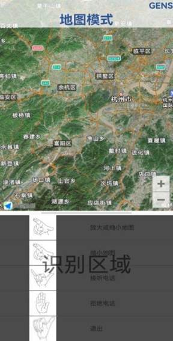
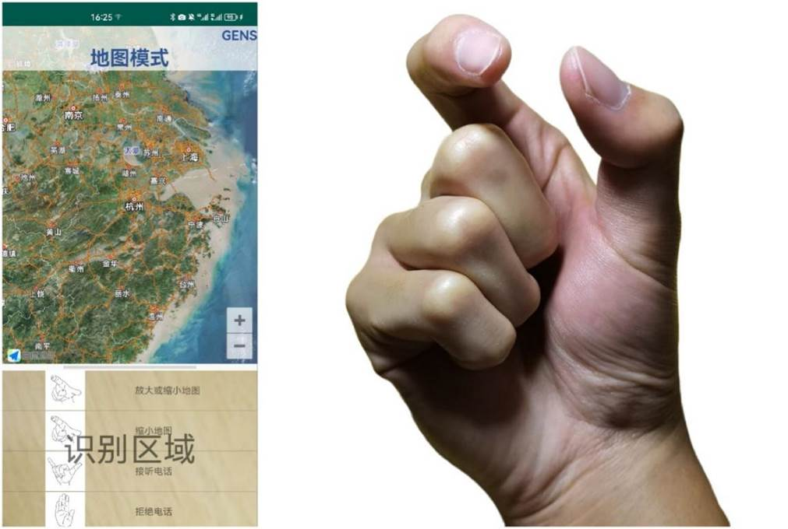
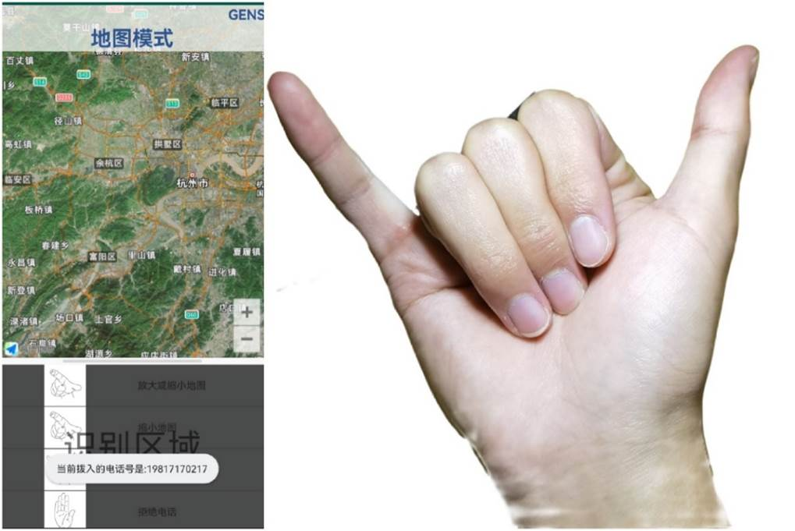
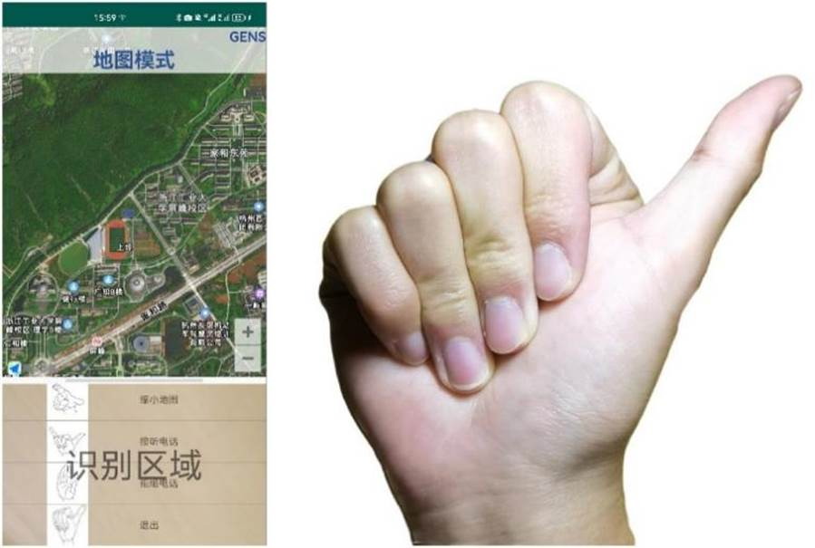
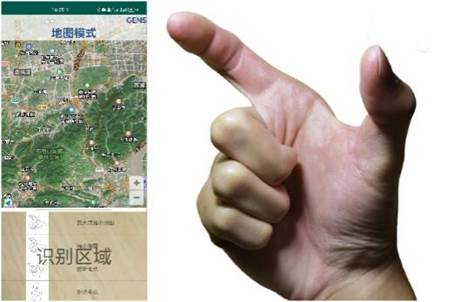
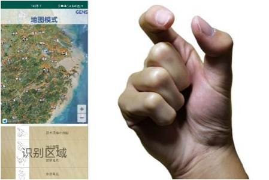
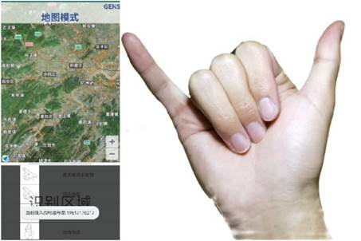
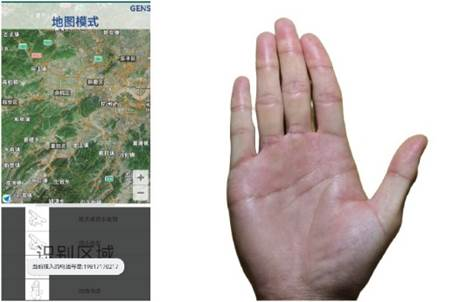
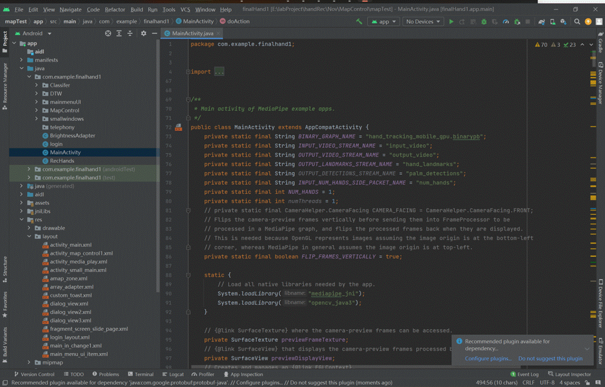

## 1.1编写目的

随着移动设备上支持的交互方式不断增加，在新冠疫情的影响下，社会对于公共场所中的无接触交互方式产生了巨大的需求。我们因此设计了使用空中交互方式的地图控制应用程序，旨在帮助用户在必要的场景下使用空中交互方式进行地图的相关操作。设计的地图应用程序包含了放大、缩小、定位在内的对地图的常用操作。对于在安卓移动设备上安装了Map Control安卓应用程序的用户，我们的操作手册旨在使用户快速熟悉操作界面，认识应用程序使用的空中手势交互方式以及系统的功能和每个功能使用到的手势，从而在此基础上能够快速上手进行实际操作。

## 1.2．项目背景

在计算机发展过程中，人机交互的方式也在不断发展和扩大。对于移动设备而言，传统的交互方式多为触摸屏幕或点击按钮。但是随着移动设备计算能力的提升以及计算机视觉等相关领域的发展，移动设备上支持的交互方式也逐渐增加。

生活中常见的交互方式：语音、空中手势等成为了当前新兴交互方式的大热门。尤其是空中手势的交互方式，在我们的应用程序中，用户只需要在摄像头范围内挥一挥手，应用程序就能够进行识别和做出对应的响应。这些交互方式有效降低了用户交互上的学习成本以及支持更多的用户在更多的场景中使用。例如：在厨房中正在做饭的用户，在双手沾满食物的同时需要接听电话；在疫情流行期间的公共场所中的用户，在不想接触公共场所的设施同时需要使用导览台进行导航；在图书馆的用户需要查询藏书信息；以及聋哑朋友需要地图定位和导航。在这些场景中，用户对于直接触摸屏幕的交互方式的意愿较低，同时，语音交互方式在图书馆类似的场景或是对于聋哑朋友而言也是不合适的。

在生活场景以外，本项目设计的软件还适用于一些安全性要求较高的场景中。驾驶员在驾驶过程中的驾驶专注问题一直是一个热点问题。随着移动设备的发展，越来越多的驾驶员用户倾向于在驾驶的同时使用移动设备播放或切换音乐，传统的基于触摸屏幕的交互方式对驾驶员的认知有着较高要求，从而更容易造成驾驶员的分心，导致交通事故的发生。

因此，本设计提出的使用空中手势交互的地图控制项目，很好的满足了用户在以上某些特定场景中的交互需求，为用户使用移动设备进行地图控制提供了新的解决思路。

 

# 2．软件概述

## 2.1．目标

2.1.1设计支持用户使用空中手势进行地图缩放、移动、定位和电话的接听的安卓端应用程序。可以部署在运行安卓系统的包含智能手机和车机在内的各种移动设备上。

2.1.2可应用在车内驾驶环境中，有效减少因操作系统给驾驶员带来的视觉和认知注意力上的额外负担，从而大大减少此类交通事故的发生。

2.1.3可以为某些特殊人士（如残障人士，国际友人等）提供帮助，用手势来跨越语言和文化上的障碍。

2.1.4结合当下疫情实况，可应用在一些避免接触的公共场合，有效避免某些接触情况下的疫情传播。

2.1.5也可以应用在一些需要保持安静并且用户不方便直接接触屏幕的环境中，有效解决用户在这些场景下的痛点。

## 2.2.功能

应用程序使用移动设备的前置摄像头捕获和获取用户做出的手势图像，并使用基于高德的开源API提供地图相关服务。因此，用户在第一次使用应用程序时，需要按照安装提示，赋予应用程序相关权限。应用程序需要的权限包含：摄像头使用、存储空间访问、位置使用、接听挂断电话、电话本访问等相关权限。

当前应用程序主要设计了四个功能，分别是：放大或缩小地图，接听电话，拒绝电话，退出。

图 1 主界面

在地图控制中，界面下方的列表列举了应用程序可以对地图以及电话进行的控制，使用要求的空中手势可以实现列表内功能。

### 2.2.1放大与缩小地图功能

考虑到使用地图时用户需要对地图进行缩放操作，因此我们有了通过增大或缩小大拇指与食指之间的间距来改变地图尺寸的功能。如图所示，这是进行放大和缩小操作之前的默认地图尺寸情况：

图 2 地图初始大小

在伸出大拇指与食指，并且做出拉长两者之间的距离的手势后，地图界面会得到相应的放大，如下图所示：

图 3 地图放大

而缩小大拇指与食指之间的距离，也会使得地图界面得到相应的缩小，如下图所示

图 4 地图缩小

### 2.2.2 接听电话功能

在部分场景下，比如驾驶车辆时，遇到来电但是不方便用手点击接听电话，用户可以使用空中手势实现电话的接听，在来电时做出以下手势，即可接听来电，进行通话。如下图所示：

图 5 来电显示

### 2.2.3 拒绝电话功能

在有来电提示的情况下，若不想接听该来电，在识别区域摆出五指并拢，掌心面向屏幕的姿势，即可拒绝来电，如下图所示：

图 6 拒绝接听

### 2.2.4 地图控制界面的退出

在地图界面使用完毕或是想要使用其他界面时，可以通过伸出大拇指指尖朝左的手势来回到操作主界面，如下图所示：

 

图 7 退出地图模式

 

# 3．运行环境

**硬件要求**

| 类别     | 基本要求    |
| -------- | ----------- |
| 处理器   | 1.0G以上CPU |
| 内存容量 | 最低6GB     |
| 存储容量 | 最低128GB   |

 

**软件要求**

| 类别                | 要求         |
| ------------------- | ------------ |
| 最低Android系统版本 | Android 5.0  |
| 目标Android系统版本 | Android 12.0 |

 

**开发环境**

| 类别         | 版本                                  |
| ------------ | ------------------------------------- |
| 开发系统     | Windows 11                            |
| 开发硬件设备 | 2.0G以上CPU，4G以上内存，146G以上硬盘 |
| 开发软件     | Android studio 21.2.0                 |

 

# 4．使用说明

## 4.1安装和初始化

移动端：获取和安装Map_Control.apk文件，按照软件提示打开需要的相关权限后，在手机前置摄像头范围内做出手势，对地图进行相应的控制。

## 4.2输入和输出

用户做出操作界面相应手势后，操作界面作出反应。除去空中手势交互方式外，应用程序同时支持点击界面列表中相应位置单元格进行触控输入。空中手势交互与触控在内的两种交互方式输加强了系统的鲁棒性，使应用程序可以面对多种不同场景。

除去应用程序安装包中自带的手势库和手势模板外，为了和不同用户的手势动作习惯进行更好的兼容，软件还设计了用户手势动作捕捉界面，用户应用程序模型的再训练，以提高用户手势识别的准确率，带给用户更为灵敏的识别效果。

### 4.2.1运行说明

|  | 放大地图 |
| --------------------------------------- | -------- |
|  | 缩小地图 |
|  | 接听电话 |
|  | 拒绝电话 |
|  | 退出     |

 

# 5．程序文件和数据文件一览表

 